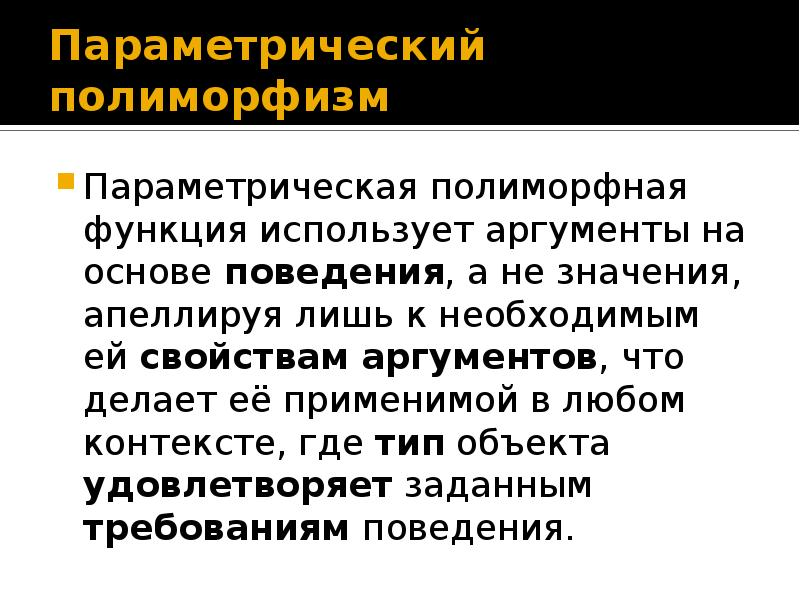

# OOP
#
## Encapsulation
#### Инкапсуляция — это объединение данных и методов, которые воздействуют на эти данные таким образом, что доступ к этим данным ограничивается извне, или, как описывает это Алан Кей, «локальное сохранение, защита и сокрытие состояния-процесса». В ООП это означает, что объект хранит свое состояние конфиденциально, и только методы объекта имеют доступ к его изменению.

#
## Polymorphism
#### Полиморфизм — возможность написать одну функцию, которая обрабатывает множество типов данных — является фундаментальной формой абстракции. Действительно, абстракция и полиморфизм, рассматриваемые абстрактно, описывают одно и то же. А поскольку очевидно, что существует много видов абстракций, неудивительно, что существует много видов полиморфизма.
##### Параметр позапросу

##### Данные разных классов

